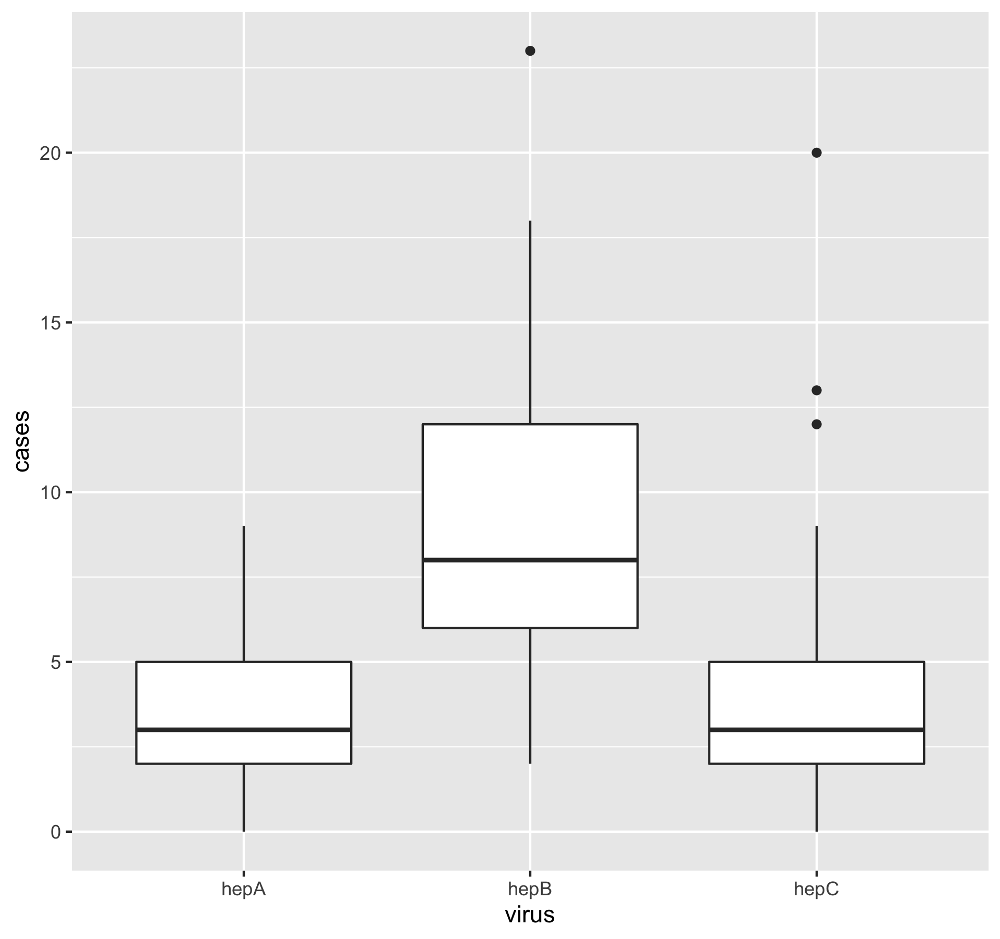
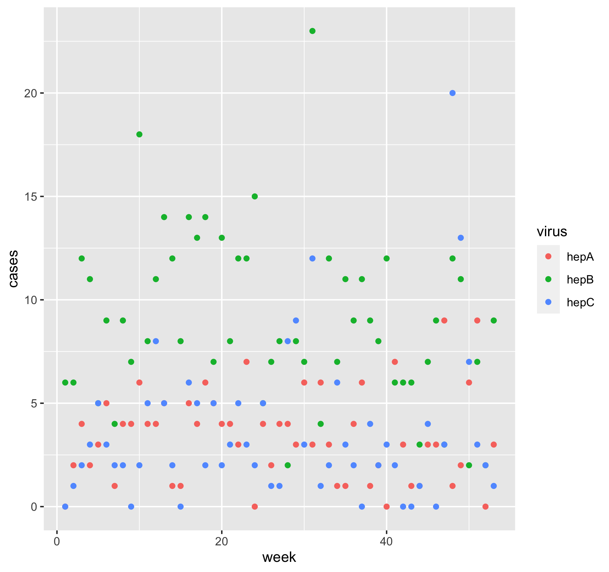
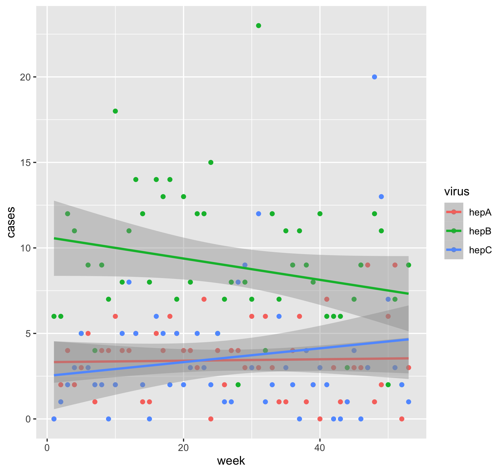
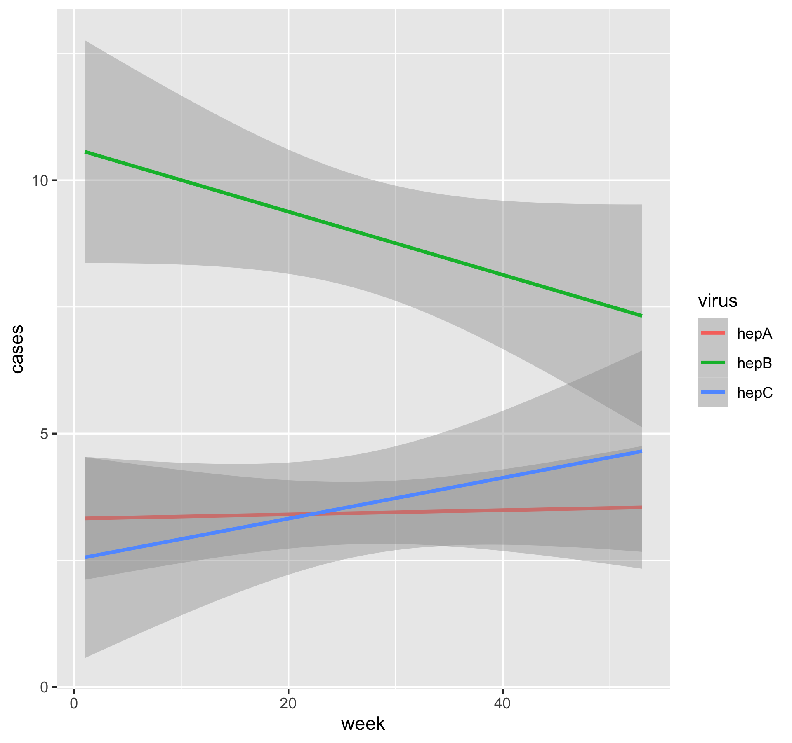

# Summary/Abstract
This document summarizes the results of our analysis from the Module 4 data wrangling exercise. Data was obtained on Hepatitis A, B, and C cases by week. 


## Questions/Hypotheses to be addressed
How do cases of Hepatitis A, B, and C change over time throughout the course of the ~60 week study period? 

## Data import and cleaning

Data import and cleaning was performed in the R Script "processingscript.R". Data was imported from the National Notifiable Diseases Surveillance System via the CDC. Processing included renaming variables, assigning NA values, and refining the data set to include only a specific geographic area (the South). 


## Exploratory analysis

Table \@ref(tab:summarytable) shows a table summarizing the data.


```{r summarytable,  echo=FALSE}
resulttable=readRDS("../../results/summarytable.rds")
knitr::kable(resulttable, caption = 'Data summary table.')
```


Figure \@ref(fig:resultfigure) shows a boxplot figure produced by one of the R scripts. It appears that hepA and hepC exhibited similar case numbers, while hepB had a greater number of weekly cases throughout the study period. 

```{r resultfigure,  fig.cap='Analysis figure.', echo=FALSE}

```

Figure \@ref(fig:resultfigure2) shows a scatterplot demonstrates the number of Hepatitis cases by strain over a period of weeks. No clear trends are immediately apparent by looking at this plot, though we see higher case numbers for hepB and similar case numbers for hepA and hepC. 

```{r resultfigure2,  fig.cap='Analysis figure 2.', echo=FALSE}

```

Figure \@ref(fig:resultfigure3) applies a best fit to the initial scatterplot. Based on this fit, hepB cases decrease throughout the study period, while hepC cases increase slightly and hepB cases remain constant. 

```{r resultfigure3,  fig.cap='Analysis figure 3.', echo=FALSE}

```

Figure \@ref(fig:resultfigure4) showcases the lines of best fit for each Hepatitis strain over time without the scatterplot points. There is a clear decrease in hepB cases, a slight increase in hepC cases, and a consistent number of hepA cases. 

```{r resultfigure4,  fig.cap='Analysis figure 4.', echo=FALSE}

```


